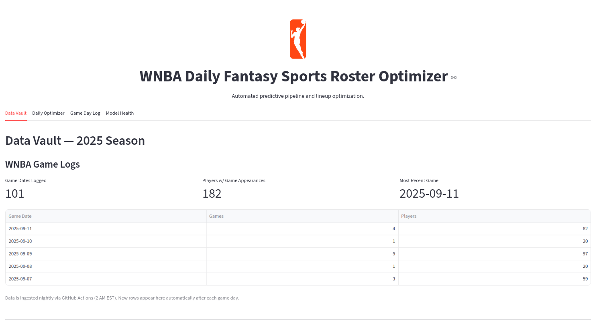
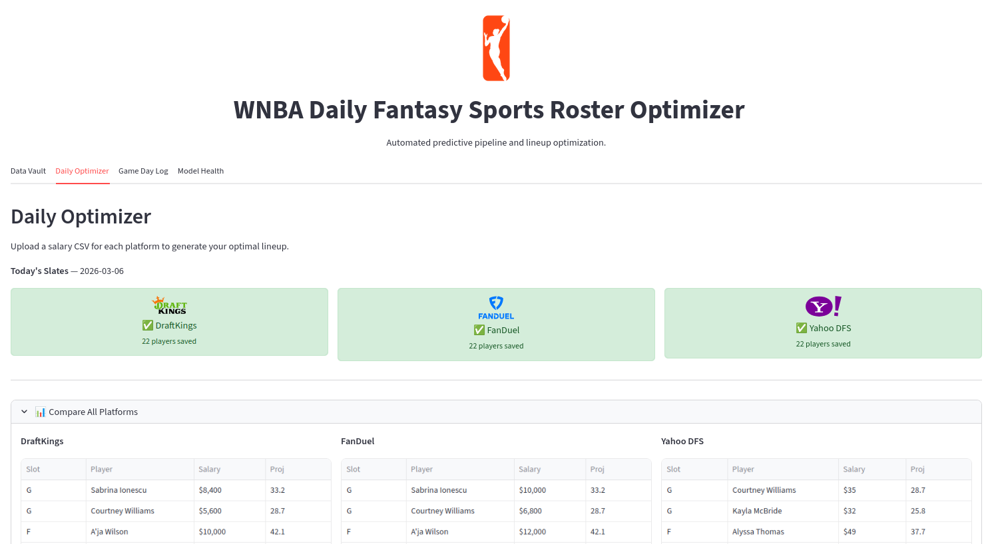
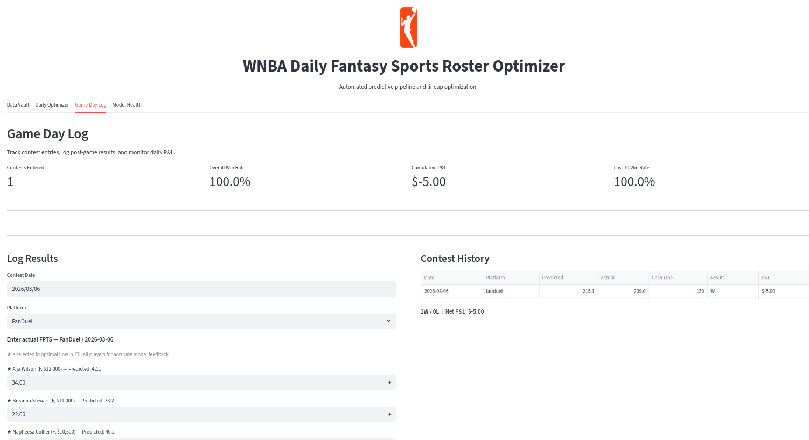
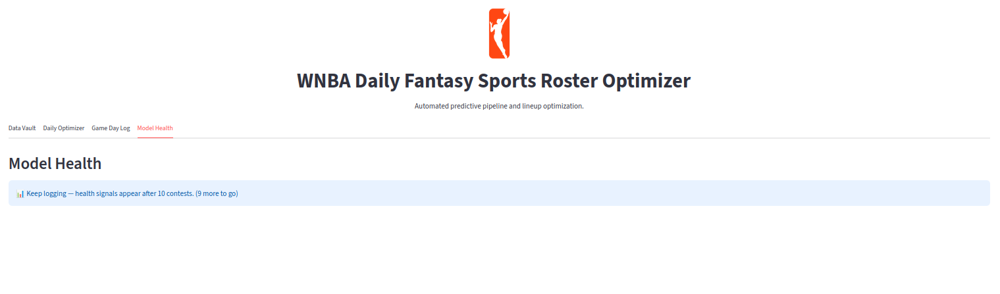

# WNBA Fantasy MLOps Engine

> End-to-end MLOps pipeline for WNBA Daily Fantasy Sports (DFS) lineup optimization for multiple platforms.
> Trains an XGBoost regression model to predict player fantasy points, then solves a
> salary-constrained lineup optimization problem to generate optimal 6-player rosters.


---

## Overview

WNBA Daily Fantasy Sports requires predicting which players will outperform their salary value
on a given game night. This project builds a **production-grade MLOps pipeline** that:

1. **Ingests** daily WNBA game statistics via `nba_api` on an automated schedule
2. **Engineers features** with a Bayesian cold-start system for rookies and unproven players
3. **Trains and tunes** an XGBoost regression model tracked in MLflow on DagsHub
4. **Optimizes** a salary-constrained lineup using linear programming (PuLP)
5. **Serves results** via a Streamlit dashboard with live slate upload

The system is designed for real-world deployment: data is versioned with DVC/S3, models are
evaluated with proper temporal holdout validation, and all configuration is centralized.

---

## Dashboard

The Streamlit dashboard has four tabs:

| Tab | Purpose |
|---|---|
| Data Vault & OSINT | Game log accumulation report, player vault stats, rookie proxies, and feature engineering table |
| Daily Optimizer | Per-platform sub-tabs (DK / FD / Yahoo) with a 4-step wizard: upload slate → generate lineup → review/edit → save |
| Game Day Log | Pre-populate a slate on game day; enter actual scores post-game; track W/L and P&L |
| Model Health | Rolling win rate chart, feature drift detection, and retrain recommendation |

**Data Vault — three sections:**
1. **WNBA Game Logs** — metrics (game dates logged, players w/ appearances, most recent game) + 5-row per-date breakdown; shows live ingestion progress during the season
2. **Players** — currently rostered player count, NCAA proxy count, INTL proxy count, and rookie translation proxy tables
3. **Feature Engineering** — live view of the processed features (Golden Table) fed to XGBoost

**Daily Optimizer — 4-step wizard (per platform):**
1. **Upload Slate** — drop the platform's salary CSV; shows player count, game count, cap, slot requirements, and any injury flags
2. **Generate Lineup** — runs XGBoost inference then PuLP optimizer; auto-collapses when complete
3. **Review & Edit** — slot-based table (G / G / F / F / F / UTIL) with position-filtered dropdowns for manual swaps; live salary cap and projection totals; over-cap warning blocks saving
4. **Save / Delete** — writes all players to `slate_scores.csv`; delete clears session state and removes saved rows

A **Compare All Platforms** panel appears above the sub-tabs once any platform has a lineup, showing all lineups side-by-side.

Saved lineups are automatically **restored from `slate_scores.csv`** on page reload — the wizard checkmarks, Compare panel, and Review & Edit table all repopulate without re-uploading the slate.


*Tab 1 — Game log report, player vault stats, and rookie proxy tables*


*Tab 2 — Platform sub-tabs with step-by-step wizard and editable slot-based lineup*


*Tab 3 — Log contest entries and actual player scores after each game night*


*Tab 4 — Monitor rolling win rate and scoring environment drift*

---

## Pipeline Architecture

```
GitHub Actions (2 AM EST, daily)
        │
        ▼
Data Ingestion (nba_api)
  └─ Game logs → data/raw/         (DVC → S3)
  [Player vault built manually — run build_player_vault.py at season start / trade deadline]
        │
        ▼
Feature Engineering (build_features.py)
  └─ Rolling averages (3-game, 10-game windows)
  └─ Bayesian season priors
  └─ Rookie cold-start proxy blending
  └─ → data/processed/training_features.csv  (DVC → S3)
        │
        ▼
Model Training (tune.py → DagsHub → train.py)
  └─ Grid search over XGBoost hyperparameters
  └─ Experiment tracking in MLflow / DagsHub
  └─ Holdout model (2021-2024 train / 2025 test) separate from production
        │
        ▼
Inference + Optimization (predict.py + optimizer.py)
  └─ XGBoost predicts fantasy points per player
  └─ PuLP solves salary-constrained lineup (CBC solver)
        │
        ▼
Streamlit Dashboard (dashboard.py)
  └─ Daily Optimizer / Data Vault / Model Health tabs
```

---

## Key Technical Features

### Bayesian Cold-Start for Rookies
New players have no WNBA history, making predictions unreliable. The pipeline uses a
multi-path proxy system rather than defaulting to a flat average:

- **NCAA players**: Stats scraped from Sports-Reference and translated via a configurable
  `NCAA_ROOKIE_TAX` multiplier (default 0.65×) to account for the college-to-pro gap
- **International pros**: Hand-entered raw overseas FPTS stored in `target_rookies.csv`,
  translated via `INTL_PRO_TAX` (default 0.85×)
- **Fallback**: Flat 12.0 FPTS baseline for players with no available proxy data

Tax rates are defined in `config.py` — adjusting them affects all players instantly without
touching feature engineering code.

### No Data Leakage
Raw box score stats (PTS, REB, AST, etc.) are explicitly dropped before model training.
The model only sees engineered features: rolling averages, Bayesian season priors, and
opponent adjustments. This prevents the model from memorizing individual game outcomes
rather than learning generalizable patterns.

### Temporal Holdout Validation
Rather than a random train/test split, the model is evaluated using a **season-level holdout**:
train on 2021–2024, evaluate on all of 2025. This reflects real deployment conditions where
the model must predict an entirely unseen future season.

### Multi-Platform DFS Support
The dashboard supports DraftKings, FanDuel, and Yahoo DFS. Each platform has its own
salary cap, roster constraints, and scoring YAML. The optimizer is parameterized — adding
a new platform is a single config dict entry, no code changes.

Scoring weights live in `config/scoring/`. The three platforms differ meaningfully:

| Stat | DraftKings | FanDuel | Yahoo |
|---|---|---|---|
| PTS | 1.0 | 1.0 | 1.0 |
| REB | 1.25 | 1.2 | 1.2 |
| AST | 1.5 | 1.5 | 1.5 |
| STL / BLK | 2.0 | 3.0 | 3.0 |
| TOV | -0.5 | -1.0 | -1.0 |
| 3PM | 0.5 | 0.0 | 0.5 |
| DD / TD bonus | +1.5 / +3.0 | — | — |

> ⚠️ **Verify all scoring weights against official 2026 published rules before the season opens.**
> The STL/BLK and double-double differentials shift value meaningfully between platforms —
> particularly for high-usage bigs on DraftKings.

**Platform-specific models (future work):** The current single XGBoost model predicts
relative player quality, which generalizes across platforms. Once a season's worth of
labeled data accumulates in `slate_scores.csv` per platform, separate per-platform
models may improve absolute FPTS calibration.

---

## Model Evaluation

### Walk-Forward MAE — 2025 Season

The model is evaluated using **walk-forward validation**: starting from a pre-season baseline,
one game date of 2025 data is added to the training set at a time, and MAE is measured on
all remaining future 2025 games. This mirrors real deployment — the model improves as the
season progresses and in-season signal accumulates.


| Metric | Value |
|---|---|
| MAE at season start (pre-2025 model only) | 6.696 |
| MAE at season end (full 2025 data seen) | 6.354 |
| Improvement over season | 0.342 pts |
| Naive baseline (always predict season avg) | 6.710 |
| Dates model beats naive baseline | **91 / 91** |

The model outperforms the naive baseline on every single date of the season. MAE starts
nearly at the naive baseline (the model is working from prior-season priors only) and
steadily improves as in-season rolling features gain signal.

---

### Lineup Quality — Model vs. Random Baseline

Walk-forward MAE measures individual player prediction accuracy. The more operationally
relevant question is: **do better predictions produce winning DFS lineups?**

Three time-sliced models are tested against their corresponding future windows, alongside a
**random baseline** — uniform random player predictions fed through the same optimizer and
constraints — to confirm the model is genuinely discriminating and not just clearing an
easy threshold.


| Slice | Train Data | Test Window | Model Win% | Random Win% | Model Avg FPTS | Random Avg FPTS |
|---|---|---|---|---|---|---|
| Pre-season | 2021–2024 only | May–Jun 2025 | **100.0%** | 15.2% | 198.91 | 113.24 |
| Mid-season | + May–Jun 2025 | Jul–Aug 2025 | **95.5%** | 6.8% | 195.55 | 107.05 |
| Late-season | + Jul–Aug 2025 | Sep 2025 | **100.0%** | 0.0% | 193.00 | 105.11 |

*Cash line: 150.0 FPTS (DraftKings 50/50 proxy). Win = lineup scores ≥ 150 FPTS.*

**Key findings:**
- The model adds **~85 FPTS of value** over random selection — confirming it is genuinely
  identifying high-value players, not clearing a trivially easy threshold
- The **pre-season model** (zero in-season data) already wins 100% of slates — the optimizer
  is robust to early-season prediction noise, making opening-day deployment safe
- The MAE improvement over the season does not translate to materially better lineup quality;
  the optimizer absorbs early prediction imprecision and good lineups emerge regardless

---

## Project Structure

```
src/
  config.py               # Central configuration — all knobs in one place
  data/                   # Ingestion: game logs, player vaults, rookie proxies
  features/
    build_features.py     # Feature engineering pipeline → training_features.csv
  models/
    train.py              # XGBoost training with MLflow tracking + holdout support
    tune.py               # Hyperparameter grid search (GPU-accelerated via CUDA)
    predict.py            # Inference engine
  inference/
    optimizer.py          # PuLP linear programming lineup optimizer
    bulk_backtest.py      # Batch historical simulation with random baseline support
  utils/

app/frontend/
  dashboard.py            # Streamlit UI (4 tabs — see Dashboard section above)

tests/
  walk_forward_2025.ipynb    # Walk-forward MAE analysis
  lineup_quality_2025.ipynb  # Lineup quality vs. random baseline

config/scoring/
  wnba_default.yml        # Fantasy point weights (swap without code changes)

data/
  raw/        # API-fetched game logs (DVC → S3)
  rosters/    # Player vaults per season (DVC → S3)
  curated/    # Hand-maintained files (target_rookies.csv, slate_scores.csv, contest_log.csv)
  processed/  # Pipeline outputs (training_features.csv, rookie_proxies.csv)
  slates/     # DraftKings salary CSVs (optimizer input, gitignored)
```

---

## Game Day Workflow

Two files in `data/curated/` accumulate season-long contest tracking data:

- **`slate_scores.csv`** — one row per player per slate (predicted + actual FPTS, `was_selected` flag)
- **`contest_log.csv`** — one row per contest (lineup score, cash line, W/L, entry fee, payout)

**On game day (before games start):**
1. Download the salary CSV from each platform you're playing (DraftKings, FanDuel, Yahoo)
2. In Tab 1, click the platform sub-tab (e.g. DraftKings)
3. **Step 1** — Upload the salary CSV; review player count, injury flags, and slot requirements
4. **Step 2** — Click **Generate Optimal Lineup**; XGBoost inference runs, then PuLP optimizes
5. **Step 3** — Review the slot-based lineup (G/G/F/F/F/UTIL); swap any player via the dropdown (position-filtered); check salary cap and projection totals
6. **Step 4** — Click **Save Predicted Slate** to write all players to `slate_scores.csv`
7. Repeat Steps 2–6 in each platform sub-tab for every platform you're playing

Use the **Compare All Platforms** panel to view all lineups side-by-side before locking.

**After the games:**
1. Go to Tab 3 (Game Day Log)
2. Select the contest date and platform — player rows are pre-filled from `slate_scores.csv`
3. Enter the actual FPTS for every player on the slate
4. Enter the cash line, entry fee, and payout → **Submit Results**
5. Repeat for each platform you played

This writes actual scores to `slate_scores.csv` and appends a summary row to `contest_log.csv`.
Both files are DVC-tracked (private S3) and build into a labeled dataset for 2026 model improvement.

---

## Quickstart

```bash
# 1. Install dependencies
pip install -r requirements.txt

# 2. Set up credentials
cp .env.example .env
# Fill in: AWS_ACCESS_KEY_ID, AWS_SECRET_ACCESS_KEY,
#          MLFLOW_TRACKING_URI, MLFLOW_TRACKING_USERNAME, MLFLOW_TRACKING_PASSWORD

# 3. Pull versioned data from S3
dvc pull

# 4. Build features
python src/features/build_features.py

# 5. Train model (production mode — all historical data)
python src/models/train.py

# 6. Launch dashboard
streamlit run app/frontend/dashboard.py
```

### Holdout Model (for backtesting)
```bash
# Grid search on DagsHub, then download best model manually
python src/models/tune.py

# Or train a single run on 2021-2024, evaluate on 2025
# Saves to src/models/holdout/ — never overwrites production
python src/models/train.py --holdout-season 2025

# Run bulk backtest against 2025 slates
python src/inference/bulk_backtest.py --start-date 2025-05-01 --end-date 2025-09-30
```

---

## Tech Stack

| Layer | Technology |
|---|---|
| Language | Python 3.12 |
| ML Model | XGBoost (GPU via CUDA) |
| Optimization | PuLP (CBC solver) |
| MLOps Tracking | MLflow + DagsHub |
| Data Versioning | DVC + AWS S3 |
| Automation | GitHub Actions (daily ingest, 2 AM EST) |
| Dashboard | Streamlit |
| Data Source | nba_api, requests / BeautifulSoup |

---

## Configuration

All key settings live in `src/config.py`:

| Variable | Purpose |
|---|---|
| `CURRENT_SEASON` | Active season for the dashboard and live optimizer |
| `HOLDOUT_SEASON` | Season withheld from training for evaluation |
| `NCAA_ROOKIE_TAX` | College → WNBA FPTS translation multiplier (default 0.65) |
| `INTL_PRO_TAX` | International pro → WNBA FPTS translation multiplier (default 0.85) |
| `ROLLING_WINDOW_SHORT/LONG` | Feature rolling windows (3 and 10 games) |
| `PLATFORM_CONFIGS` | Per-platform dict for DraftKings, FanDuel, and Yahoo DFS. Each entry has `salary_cap`, `roster_slots`, `scoring_system`, and `csv_columns` (maps internal names → platform CSV headers, including `injury`/`starting` columns). FD/Yahoo caps marked `# ← verify` until confirmed from a real slate. |
| `SALARY_CAP` / `ROSTER_SLOTS` | Legacy DraftKings-only values kept for backward compatibility with `bulk_backtest.py` — use `PLATFORM_CONFIGS` for new code |
| `LAST_RETRAINED` | Date of last production model retrain — update after each retrain |
| `SLATE_SCORES_PATH` | Path to per-player contest tracking file |
| `CONTEST_LOG_PATH` | Path to per-contest summary log |

---

## Automated Data Pipeline

A GitHub Actions workflow (`.github/workflows/daily_ingest.yml`) runs every night at 2 AM EST:
fetches the previous day's game logs via `nba_api`, updates DVC pointers, and pushes versioned
data to S3. The model is retrained periodically as the season accumulates data.

---

## Rookie Workflow

```bash
# 1. Edit the target list (ORIGIN_LEAGUE = NCAA or INTL)
#    Fill MANUAL_PROXY (raw overseas FPTS) for INTL players
vim data/curated/target_rookies.csv

# 2. Regenerate proxies
python src/data/build_rookie_proxies.py
#    NCAA: scrapes Sports-Reference final season stats, applies NCAA_ROOKIE_TAX
#    INTL: reads MANUAL_PROXY column, applies INTL_PRO_TAX
#    Output: data/processed/rookie_proxies.csv
```

---

## Acknowledgements

**Teresa K. Pegors** — Project design, domain expertise, data strategy, and all final engineering decisions.

**Claude (Anthropic)** — AI pair programmer throughout development. Contributed to code architecture,
refactoring, feature engineering logic, model evaluation methodology (walk-forward validation,
random baseline comparison), and this README.

**Google Gemini** — Assisted in early-stage ideation and initial scaffolding of the project structure.

---

*Built by Teresa K. Pegors · [DagsHub Experiment Tracker](https://dagshub.com/t-pegors/wnba-fantasy-mlops)*
